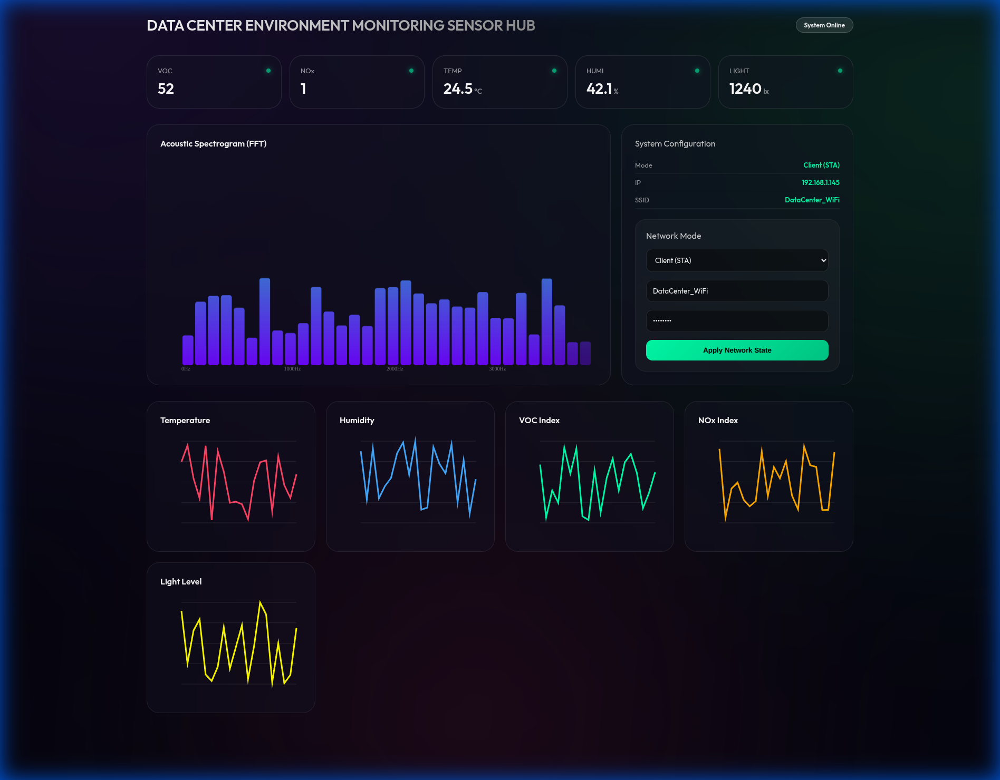
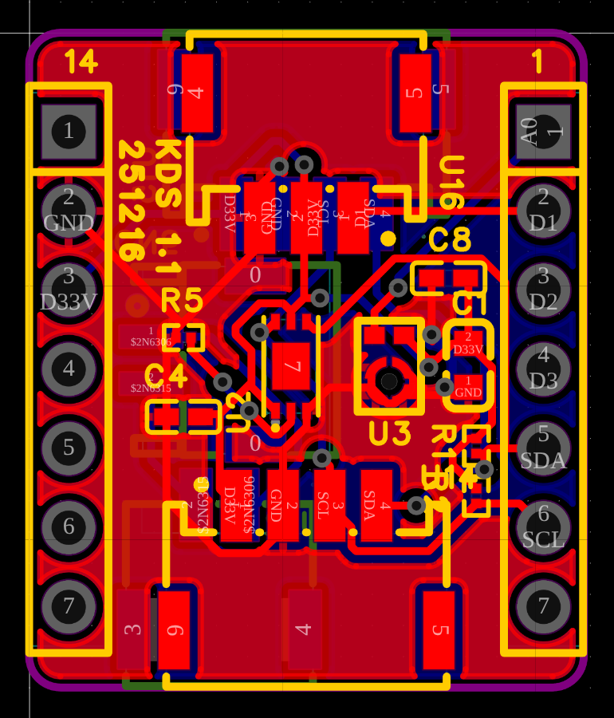
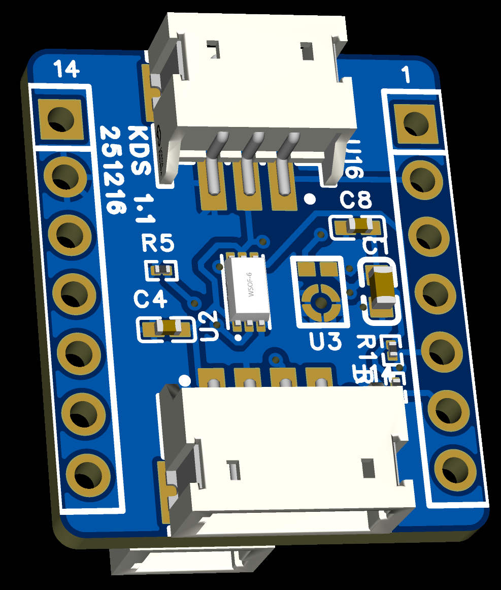

# DATA CENTER ENVIRONMENT MONITORING SENSOR HUB (V7.4)

ESP32-S3와 고성능 센서를 활용하여 데이터 센터 및 서버실 환경을 정밀 모니터링하는 전문 시스템입니다.
A professional system for precision monitoring of data center and server room environments using ESP32-S3 and high-performance sensors.

---

## 주요 기능 및 업데이트 (Version 7.4 Updates)

### 1. Ultra-Premium Glassmorphism UI
- **Modern Aesthetics**: 최신 디자인 트렌드를 반영한 고품격 유리 질감 대시보드 (State-of-the-art glassmorphism design).
- **Dynamic Backdrop**: 실시간 애니메이션 메쉬 그래디언트 배경 적용 (Animated mesh gradient background).
- **Hero Metrics**: 주요 지표(VOC, NOx, Temp, Humi, Lux)를 강조하는 전용 히어로 카드 배치 (Dedicated hero cards for critical metrics).

### 2. 정밀 데이터 안정화 (FFT & Data Stability)
- **DC Offset Removal**: 사운드 신호의 직류 편향을 제거하여 FFT 베이스라인 안정화 (Stabilized FFT baseline by removing DC bias).
- **Bin-level EMA Smoothing**: 각 주파수 대역별 지수 이동 평균 필터를 통한 노이즈 억제 (Noise suppression via per-bin exponential smoothing).
- **Noise Floor Cutoff**: 저전력 노이즈를 차단하여 완벽한 정적 상태 구현 (Threshold filtering for a clean noise floor).

### 3. 센서 통합 및 복구 (Sensor Integration)
- **SHT4x Restoration**: 고정밀 온도/습도 센서 재통합 및 SGP41 보정 연동 (Re-integrated SHT4x for precise T/H and SGP41 compensation).
- **Multi-Address Scanning**: I2C 0x44/0x45 주소 자동 검색으로 하드웨어 호환성 증대 (Automatic I2C scanning for enhanced compatibility).
- **Guru Meditation Protection**: 센서 미연결 시 시스템 충돌 방지 및 대체 데이터(Fallback) 로직 적용 (Robust error handling to prevent system crashes).

---

## 하드웨어 구성 (Hardware Configuration)

- **Controller**: Seeed Studio XIAO ESP32-S3
- **Sensors**: 
  - **SHT4x**: 온도 및 습도 (Temperature & Humidity)
  - **SGP41**: VOC 및 NOx 가스 지수 (VOC & NOx Gas Index)
  - **BH1750**: 주변 조도 (Ambient Light)
  - **Analog Sound**: 실시간 소음 및 주파수 분석 (Noise & FFT Analysis)
- **Actuator**: PWM Servo Motor (System Control)

---

## 시스템 프리뷰 (System Preview)

### 1. 소프트웨어: 실시간 대시보드 (Software: Real-time Dashboard)
최신 Glassmorphism UI가 적용된 고해상도 모니터링 화면입니다.



### 2. 하드웨어: 설계 및 구조 (Hardware: Design & Architecture)
데이터 수집을 위한 맞춤형 하드웨어 설계 및 회로 구성입니다.

| 항목 (Category) | 이미지 (Image) |
| :--- | :--- |
| **Circuit Diagram** |  |
| **PCB Layout** |  |
| **3D PCB Rendering** |  |

---

## API 및 데이터 확인 (API Access)

```bash
# 실시간 센서 데이터 (Snapshot JSON)
curl -s http://<ESP32_IP>/data | jq .
{"temp":26.8,"humi":30.6,"lux":64.2,"voc":64,"nox":1,"sraw_voc":27941,"sraw_nox":12687,"c2":1,"c3":1}
# FFT 주파수 데이터 (Spectral Analysis JSON)
curl -s http://<ESP32_IP>/fft | jq .
[{"freq":0,"mag":253.3},{"freq":125,"mag":210},{"freq":250,"mag":220.1},{"freq":375,"mag":225.6},{"freq":500,"mag":214.7},{"freq":625,"mag":200.4},{"freq":750,"mag":196.1},{"freq":875,"mag":192.7},{"freq":1000,"mag":195},{"freq":1125,"mag":192.7},{"freq":1250,"mag":195.7},{"freq":1375,"mag":189.9},{"freq":1500,"mag":187.3},{"freq":1625,"mag":198.6},{"freq":1750,"mag":190.6},{"freq":1875,"mag":185.1},{"freq":2000,"mag":174.7},{"freq":2125,"mag":192.7},{"freq":2250,"mag":189.4},{"freq":2375,"mag":184.5},{"freq":2500,"mag":187.2},{"freq":2625,"mag":187.9},{"freq":2750,"mag":188.6},{"freq":2875,"mag":183.7},{"freq":3000,"mag":185.4},{"freq":3125,"mag":194.9},{"freq":3250,"mag":182.8},{"freq":3375,"mag":188.4},{"freq":3500,"mag":189.6},{"freq":3625,"mag":173.9},{"freq":3750,"mag":174.5},{"freq":3875,"mag":171.9}]
```

